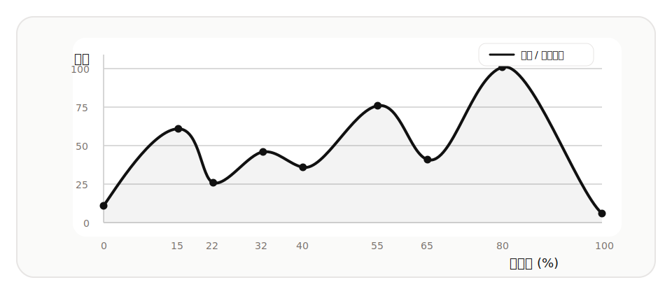
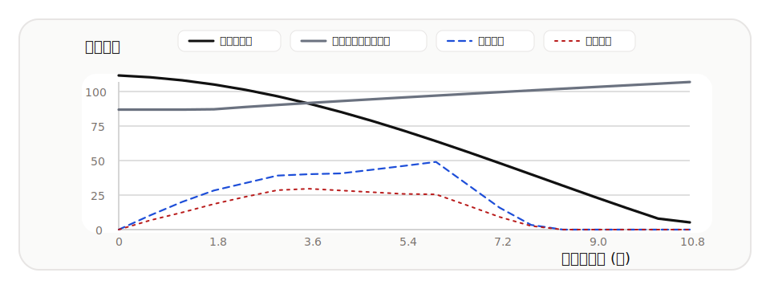

  

# LiveSort

LiveSort 是一个面向本地音乐整理场景的歌曲无感过渡与自动排序工具。它会分析每首歌的节奏、能量与段落特征，再把歌单重新编排成更接近演出现场叙事节奏的播放顺序。

## 设计哲学

LiveSort 的诞生源于一个简单的想法：如何让杂乱无章的日常歌单，带来如同亲临演唱会现场般的沉浸体验？

一场优秀的演唱会，其歌单绝不是随机播放的。它讲究“一收一发”，用抓耳但渐进的歌曲开场，在中间穿插节奏与抒情，避免观众因持续的高潮而情绪疲劳，也不会因为一直抒情而感到沉闷，最终以温暖的歌曲完美收尾。

LiveSort 试图通过音频特征分析与算法编排，在本地重现这种情绪的起伏。

## 优秀兴趣曲线

歌单整体会被投射到一条理想的情绪曲线上：从开场进入、逐步铺垫、中段回落、后段递进，再抵达高潮。

- **开场**：更适合听感友好、进入门槛低的歌曲
- **铺垫**：逐步抬升节奏和能量
- **回落**：避免持续高压带来的疲劳
- **递进与高潮**：把最适合点燃氛围的歌曲留到后段

## 音频特征提取

LiveSort 现在在浏览器端完成音频分析，不依赖 Python 后端。基于 Web Audio API 的本地分析流程会提取每首歌的核心特征，包括：

- **BPM / 节奏感**：判断速度衔接是否自然
- **能量 / 情绪强度**：决定歌曲在整体曲线中的位置
- **亮度 / 听感质地**：辅助判断风格变化是否突兀
- **首尾片段特征**：专门分析歌曲开头与结尾，提升切换判断准确度
- **NCM 本地解密后分析**：`.ncm` 文件会先在浏览器本地转换，再进入同一分析流程

## 排序算法

排序核心是一个面向实际听感的贪心优化过程。对于歌单中的每一个位置，系统会综合评估候选歌曲与目标曲线的贴合度，并同时考虑：

- 当前歌曲放在该位置是否符合目标情绪
- 与上一首歌曲的 BPM、能量、质感是否自然衔接
- 是否会让整张歌单出现过早冲顶或中段断层

最终得到的结果不是“单首最好”，而是“整组连起来更顺”。

## 无感过渡

在两首歌交接前，LiveSort 会利用首尾片段特征进行自动混入，让切换更平滑、听感更连贯。

- 上一首尾段逐渐释放空间
- 下一首前段提前进入
- 在重叠区完成平滑交接，减少突兀感

## 项目结构
- `templates/index.html`：主界面
- `templates/algorithm.html`：算法说明页
- `static/lame.min.js`：浏览器端 MP3 编码器
- `static/*.svg`：品牌图标与说明页配图

## 本地运行
1. 使用任意静态文件服务器在 `LiveSortApp` 目录启动站点（例如 VS Code Live Server）。
2. 打开首页并导入本地音频文件即可使用。

## GitHub Pages 部署
1. 将仓库默认分支设为 `main`。
2. 在仓库 Settings → Pages 中，将 Source 设为 **GitHub Actions**。
3. 推送到 `main` 后会自动触发 `.github/workflows/deploy-pages.yml`。
4. 工作流会将 `templates/index.html`、`templates/algorithm.html` 与 `static/` 打包并发布为 Pages 站点。

## 技术栈
- HTML / JavaScript / Tailwind CSS / Chart.js
- Web Audio API / OfflineAudioContext
- lamejs（浏览器端 MP3 编码）

作者主页：https://lun3cy.top
